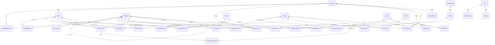

# Entity-Relationship Diagram (ERD)

```mermaid
erDiagram
    Mission ||--o{ MissionEquipment : has
    Mission ||--o{ Event : triggers
    Mission ||--o{ MissionPerson : involves
    Mission ||--o{ StoryMission : features
    Mission ||--o{ MissionSource : cites
    Mission ||--o{ ArchiveMission : archives

    Equipment ||--o{ Equipment : parent_of
    Equipment ||--o{ MissionEquipment : assigned_to
    Equipment ||--o{ EventEquipment : participates_in
    Equipment ||--o{ EquipmentLocation : situated_at
    Equipment ||--o{ EquipmentPerson : engineered_by
    Equipment ||--o{ EquipmentMedia : portrayed_in
    Equipment ||--o{ EquipmentSource : documented_by
    Equipment ||--o{ Measurement : records
    Equipment ||--o{ ArchiveEquipment : archived_in
    Equipment ||--o{ StoryEquipment : highlighted_in

    CelestialBody ||--o{ Location : contains
    Location ||--o{ EquipmentLocation : hosts
    Location ||--o{ EventLocation : occurs_at

    Event ||--o{ EventEquipment : involves
    Event ||--o{ EventLocation : situated_at
    Event ||--o{ EventPerson : attended_by
    Event ||--o{ EventSource : referenced_by
    Event ||--o{ Measurement : produces
    Event ||--o{ StoryEvent : chronicled_in
    Event ||--o{ ArchiveEvent : archived_in

    Person ||--o{ MissionPerson : contributes
    Person ||--o{ EventPerson : acts
    Person ||--o{ EquipmentPerson : builds

    Source ||--o{ MissionSource : substantiates
    Source ||--o{ EquipmentSource : substantiates
    Source ||--o{ EventSource : substantiates
    Source ||--o{ StorySource : substantiates
    Source ||--o{ MeasurementSource : substantiates
    Source ||--o{ ArchiveSource : traces

    Story ||--o{ StoryMission : narrates
    Story ||--o{ StoryEquipment : narrates
    Story ||--o{ StoryEvent : narrates
    Story ||--o{ StoryMedia : illustrates
    Story ||--o{ StorySource : cites

    Media ||--o{ EquipmentMedia : illustrates
    Media ||--o{ StoryMedia : illustrates

    Measurement ||--o{ MeasurementSource : verifies

    User ||--o{ RefreshToken : owns
    User ||--o{ AuditLog : audits
```
